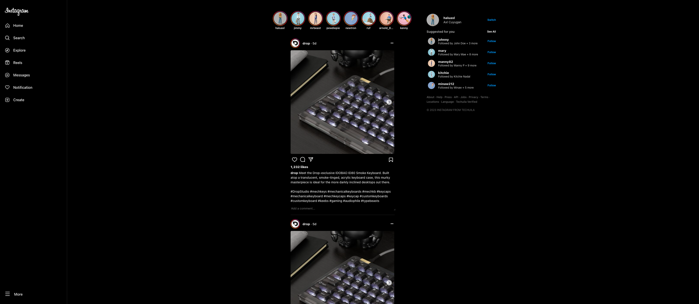

# Instagram Clone



This is a simple replica of Instagram's homepage focused primarily on the user interface, rather than functionality. The carousel for the posts is implemented using `react-virtualized`.

## Overview

The purpose of this project is to demonstrate the ability to create a visually similar homepage to Instagram. While the features and functionalities are not included in this clone, it serves as a great foundation for anyone looking to build a social media app with a similar aesthetic.

## Requirements

To run this project, you will need to use [bun.sh](https://bun.sh/), a fast, reliable, and powerful JavaScript and TypeScript runtime.

## Installation

To install the necessary dependencies, run the following command in your terminal:

```bash
instagram-clone$ cd client
instagram-clone/client$ bun install
```

This will install all the required packages and libraries needed to run this project.

## Development
To start the development server, use the following command:

```bash
instagram-clone/client$ bun dev
```

This will start the server, and you should be able to view the project in your local development environment.

Note: More details about the project structure, best practices, and other instructions can be added as necessary.